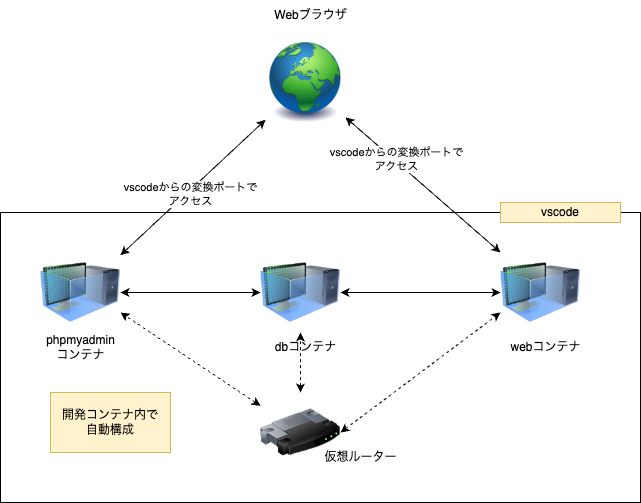

# サービス・コンテナ一覧

この環境におけるサービスとコンテナの概要をまとめています。

通常の開発では、以下のサービスが起動し、連携するようになっています。ブラウザは各自のホスト側で起動している任意のものが使えます。

## サービス `web`

`web` サービスは、Webアプリケーションを作成する、確認する目的で動かしています。

- PHPランタイム
- Webサーバー(Apache httpd) ※ Ubuntuベースのみ

Ubuntuベースのイメージでは、Apache httpdの機能拡張でPHPが組み込まれています。
AlpineベースではPHPの内蔵サーバーで代用しています(`php -S`)。

publicディレクトリ以下がWebサーバーベースで公開される部分となっており、それ以外の場所は(PHPの`require`を使わない限り)Webサーバーからはアクセスできません。

サービス用のコンテナイメージは、以下のリポジトリにてメンテナンス・改良が行われています。
- [densuke-st/xampp-devenv-image-docker](https://github.com/densuke-st/xampp-devenv-image-docker)

## サービス `db`

`db` サービスは、データベース部分を担当しています。

- 公式のMySQLのイメージをそのまま
- ただしヘルスチェック用のスクリプトを追加しています

データベースの基本部分はMySQLの公式イメージそのままで、一定時間ごとに稼働中かをチェックするヘルスチェックスケジューラーを立てられるようにスクリプトを入れています。
ヘルスチェック自体は、`docker compose`におけるhealthcheckキーで記述しないと動きませんので注意してください。

このイメージに対するサービスでは、ストレージ部分について、立ち上げ方により異なる場所が使われます。

- 通常モード(`compose.yml`)
  - Dockerボリュームによるストレージ
- テストモード(`compose.yml` + `compose_test.yml`)
  - tmpfsを用いたボリューム
  - コンテナが消滅すると自動的に消えてくれます

## サービス `phpmyadmin`

通常モード(`compose.yml`)でのみ起動するサービスであり、作成しているデータベースのGUI管理目的で使えます。
テストモードでは不要なため、起動いたしません。
